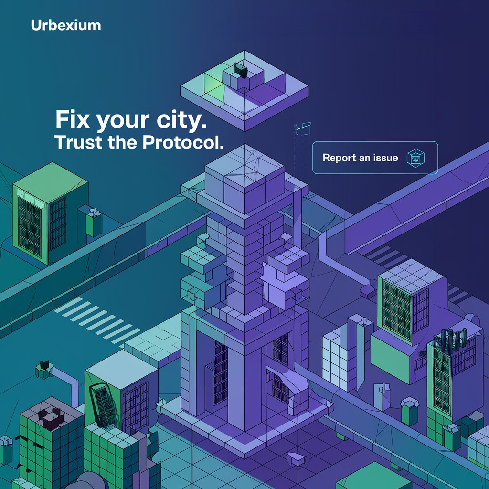

#ZENTIGRITY: Decentralized Civic Infrastructure Platform

## 🌟 Problem Statement

Modern civic infrastructure management faces critical challenges:
- **Bureaucratic Delays**: Reports get lost in manual processes
- **Zero Accountability**: No transparency in task execution
- **Privacy Risks**: Citizens fear exposing personal data
- **Payment Bottlenecks**: Slow manual payment processes
- **Crypto Complexity**: Blockchain UX barriers for mainstream users

## 🚀 Solution Overview

Zentigrity combines blockchain, AI, and decentralized governance to create a transparent civic issue resolution platform:



### Key Features
- **ZK Identity Verification**: Privacy-preserving authentication via Self Protocol
- **AI-Powered Processing**: NLP analysis & automatic task categorization
- **Reactive Smart Contracts**: Automated payments & penalties (Reactive Network)
- **Cross-Chain DAO Governance**: Quadratic voting & fund management
- **Gasless UX**: Coinbase Smart Wallets for seamless interactions

## 📋 Core Components

| Component | Technology Stack | Description |
|-----------|------------------|-------------|
| Frontend  | Next.js, Shadcn/ui | Responsive dashboard & reporting interface |
| Smart Contracts | Solidity, Foundry | Grievance handling & payment logic |
| AI Layer  | AgentKit, TensorFlow | NLP processing & predictive analytics |
| Identity  | Self.xyz | ZK-proof based authentication |
| Payments  | Reactive Network, Sablier | Streamed payments & penalty enforcement |

## 🛠️ Installation

```bash
# Clone repository
git clone https://github.com/Philotheephilix/vavasese.git

# Install dependencies
cd urbexium
npm install

# Configure environment
cp .env.example .env.local

# Start development server
npm run dev


# Ai agent Server
cd cdp-agent
pip install -r requirments.txt
python3 src/app.py

```
## 📜 Smart Contract Deployment

```bash
# Navigate to contracts directory
cd contracts/timelock-escrow

# Install dependencies
npm install

# Deploy to Base network
forge script script/Deploy.s.sol --broadcast --verify -vvvv
```

## 🌐 Key Integrations

### Core Technologies
- **Blockchain**: Base Network, Reactive Network
- **Identity**: Self Protocol (ZK Proofs)
- **AI/ML**: Hugging Face, TensorFlow
- **Payments**: Sablier Streams
- **Governance**: Quadratic Voting DAO

## 📈 Workflow Overview

1. **Citizen Report**
   - ZK-proof authentication
   - AI-powered issue categorization
   - Smart contract deployment

2. **Worker Assignment**
   - Reputation-based bidding system
   - Reactive penalty clauses
   - Milestone tracking

3. **Execution & Verification**
   - AI/Image recognition validation
   - Cross-chain data verification
   - Streamed payments

4. **DAO Governance**
   - Quadratic voting disputes
   - Transparent fund allocation
   - Protocol upgrades

## 📂 Project Structure

```
urbexium/
├── app/              # Next.js application
├── contracts/        # Solidity smart contracts
├── cdp-agent/        # AI agent implementation
├── components/       # UI components
├── lib/              # Shared utilities
├── public/           # Static assets
└── styles/           # Global CSS
```

## 🤝 Contributing

We welcome contributions! Please follow these steps:
1. Fork the repository
2. Create your feature branch (`git checkout -b feature/amazing-feature`)
3. Commit your changes (`git commit -m 'Add some amazing feature'`)
4. Push to the branch (`git push origin feature/amazing-feature`)
5. Open a Pull Request

## 📄 License

Distributed under the MIT License. See `LICENSE` for more information.

## 📧 Contact

Core Team - [kunalpsingh5@gmail.com](mailto:kunalpsingh25@gmail.com)
---

**Zentigrity** - Rebuilding Civic Trust Through Decentralized Governance  
*"Empowering Communities, One Block at a Time"*
